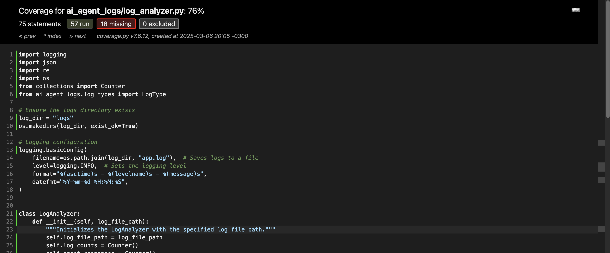
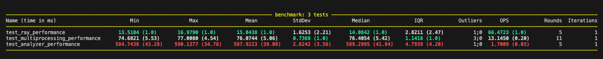

# AI Agent Log Analyzer

## 📖 Description
This project is an **AI agent log analyzer**. It reads a log file, extracts useful insights, and presents the results in a structured format.

## 🚀 Features
- ✅ Count **INFO, ERROR, and WARNING** messages.
- ✅ Extract and list **the most frequent AI responses**.
- ✅ Identify **the most common errors and their frequencies**.
- ✅ **Synthetic log generation** for testing.
- ✅ **Distributed log processing** using **Multiprocessing** and **Ray**.
- ✅ **Automated tests**, including **coverage measurement and performance benchmarking**.

## 📁 Project Structure
```bash
ai-agent-logs/
│── ai_agent_logs/                 # 📂 Diretório principal do código-fonte
│   ├── __init__.py                 # Inicializa o pacote Python
│   ├── log_analyzer.py              # Classe principal para análise de logs
│   ├── log_summary.py               # Resumo dos logs processados
│   ├── log_parser.py                # Lógica de parsing dos logs
│   ├── log_types.py                 # Enum com os tipos de logs (INFO, ERROR, WARNING)
│── distributed/                    # 📂 Processamento distribuído
│   ├── multiprocessing_analyzer.py  # 🔄 Processamento paralelo com multiprocessing
│   ├── ray_analyzer.py              # ⚡ Processamento distribuído com Ray
│── tests/                          # 📂 Testes automatizados
│   ├── __init__.py                  # Inicializa o pacote de testes
│   ├── test_log_analyzer.py          # Testes unitários do analisador de logs
│   ├── test_log_parser.py            # Testes unitários do parser de logs
│   ├── test_log_summary.py           # Testes do resumo dos logs
│   ├── test_performance.py           # ⚡ Testes de desempenho (benchmark)
│   ├── test_multiprocessing.py       # Testes para análise com multiprocessing
│   ├── test_ray.py                   # Testes para análise com Ray
│   ├── test_benchmark_multiprocessing.py  # 🚀 Benchmark de multiprocessing
│   ├── test_benchmark_ray.py         # 🚀 Benchmark de Ray
│── tools/                          # 📂 Ferramentas auxiliares
│   ├── generate_sample_logs.py       # Script para gerar logs sintéticos para testes
│── data/                           # 📂 Diretório de armazenamento de logs de teste
│   ├── sample_logs.txt               # Exemplo de arquivo de log de entrada
│── logs/                           # 📂 Diretório de saída para logs processados
│── .venv/                          # 📂 Ambiente virtual gerenciado pelo Poetry
│── img/                            # 📂 Imagens para README (exemplo: cobertura de testes)
│── README.md                        # 📖 Documentação do projeto
│── pyproject.toml                   # 📦 Configuração do Poetry (dependências)
│── poetry.lock                      # 🔒 Lockfile do Poetry
│── main.py                          # 🏁 Ponto de entrada do analisador de logs
│── pytest.ini                        # ⚙️ Configuração do Pytest
```

## Installation
### Prerequisites
- Python 3.11+
- Poetry (dependency manager)

### Installing the Project
```bash
# Clone the repository
git clone git@github.com:Guandaline/ai-agent-logs.git
cd ai-agent-logs

# Install dependencies with Poetry
poetry install
```

## Usage
### Run the Log Analyzer
```bash
poetry run python main.py
```

### Generate a Synthetic Log File
```bash
poetry run python tools/generate_sample_logs.py data/large_sample_logs.txt 50000
```

## ⚡ Distributed Processing

### Multiprocessing Log Analysis
```bash
poetry run python distributed/multiprocessing_analyzer.py
```

```bash
poetry run python distributed/ray_analyzer.py
```
## ✅ Testing
### Run All Tests
```bash
poetry run pytest tests/
```

### Measure Test Coverage
```bash
poetry run pytest --cov=ai_agent_logs tests/
```
To visualize the HTML report:
```bash
poetry run pytest --cov=ai_agent_logs --cov-report=html tests/
open htmlcov/index.html  # macOS
xdg-open htmlcov/index.html  # Linux
start htmlcov/index.html  # Windows
```
Sample:


## 🏎 Performance Benchmarking
### Multiprocessing Benchmark
```bash
poetry run pytest tests/test_benchmark_multiprocessing.py --benchmark-only
```

### Ray Benchmark
```bash
poetry run pytest tests/test_benchmark_ray.py --benchmark-only
```

### Run All Benchmarks
```bash
poetry run pytest tests/ --benchmark-columns=min,mean,max
```

Sample output:


## 📈 Future Improvements
- 🔹 Streaming process
- 🔹 Add support for JSON logs.
- 🔹 Create a web interface for insight visualization.
- 🔹 Export data to CSV or a database.
- 🔹 Optimize distributed processing for large-scale logs.

## License
This project is distributed under the MIT License.

### ✨ What's New in This Version?

- ✅ Added Distributed Processing with Multiprocessing & Ray
- ✅ Enhanced Automated Tests for scalability & correctness
- ✅ Included Performance Benchmarks for comparison

